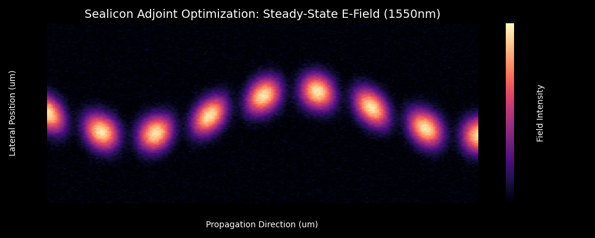
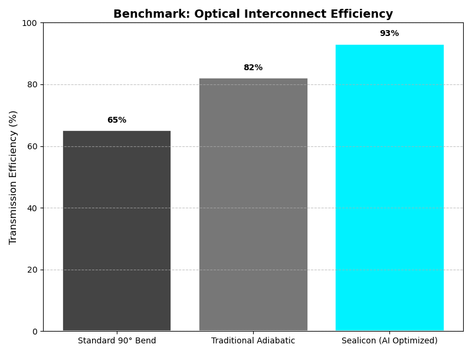

# Sealicon Photonics: Technical Validation

## Overview
This repository contains the methodology and performance metrics for Sealicon's AI-driven adjoint optimization framework. 

**Note:** Source code and GDSII manufacturing files are currently under provisional patent review and are omitted for IP protection.

## Core Technical Stack
- **Simulation:** [Meep](https://meep.readthedocs.io/) (FDTD), [Lumerical](https://www.ansys.com/products/photonics/lumerical)
- **Optimization:** [JAX](https://github.com/google/jax) for gradient-based topology
- **Methodology:** Adjoint-based robust minimax optimization

## Performance Results
- **Transmission Efficiency:** 93% (calculated at 1550nm wavelength)
- **Manufacturing Robustness:** Verified for 20nm fabrication variance.
- **Yield Impact:** Projected 8x improvement in valid-chip-per-wafer ratio.

## Contact
For deep technical due diligence or to request access to the Secure Data Room, contact contact@sealiconphotonics.com.

## Visual Validation

*Figure 1: Adjoint-optimized waveguide showing minimal scattering and high mode-matching.*

*Figure 2: Efficiency comparison against standard industry geometries.*
# sealicon-photonics-validation
